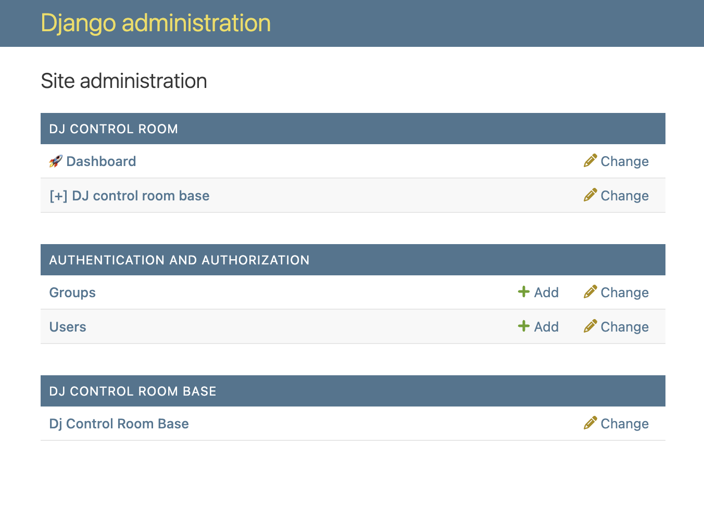
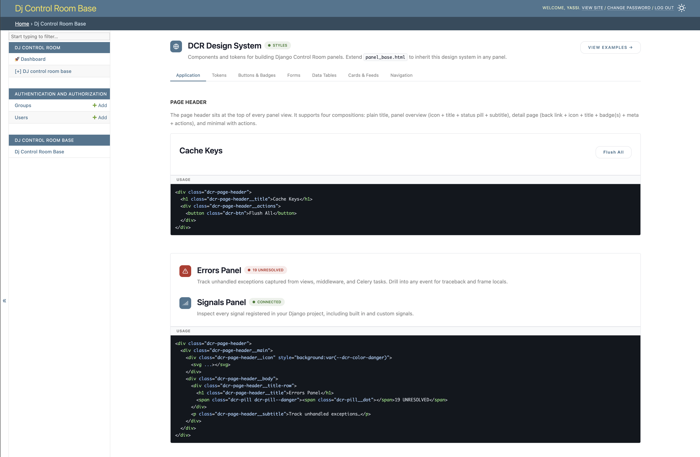

[](https://github.com/yassi/dj-control-room)
[](https://github.com/yassi/dj-control-room-base/actions/workflows/test.yml)
[](https://codecov.io/gh/yassi/dj-control-room-base)
[](https://badge.fury.io/py/dj-control-room-base)
[](https://pypi.org/project/dj-control-room-base/)
[](https://opensource.org/licenses/MIT)

# dj-control-room-base


**dj-control-room-base** is a **core library** for [Django Control Room](https://github.com/yassi/dj-control-room) panels. It provides functionality for managing panel configuration, context, permissions and styles. All featured panels (ones developed by the DCR team) will use this as a base library for creating new panels.

Additionally, this project is also an installable panel on its own. As a panel it provides
an interactive styleguide with examples that can make working on new panels all the more easier.

The library **centralizes settings** that every panel would otherwise duplicate: **CSS** (whether to load the default design-system bundle, extra stylesheets, and hub-level overrides) and **permissions** (staff checks, optional superuser-only mode, Django group allow lists, and **scoped** rules per view). Panel authors who adopt `PanelConfig`, the placeholder admin pattern (`PanelPlaceholderModel` / `BasePanelAdmin`), and the shared template context helpers get that behavior **for free** instead of wiring merges, decorators, and admin sidebar rules by hand on each project.

- **Official site:** [djangocontrolroom.com](https://djangocontrolroom.com)
- **Control Room app:** [dj-control-room](https://github.com/yassi/dj-control-room)

## Documentation

Published docs (MkDocs): [yassi.github.io/dj-control-room-base](https://yassi.github.io/dj-control-room-base/)

## What you get

- **Centralized CSS and permissions** - One `PanelConfig` + settings key merges defaults, project settings, and (when the hub is present) Control Room overrides. You declare policy once; views and the admin placeholder reuse it.
- **Discoverable panel** - Registers with Control Room via the `dj_control_room.panels` entry point (`pyproject.toml`); see `dj_control_room_base/panel.py`.
- **`PanelConfig`** - One object per panel: merges defaults, project settings, and Control Room overrides; helpers for template context, optional default and extra CSS, and **scoped** `permission_required` decorators.
- **`PanelPlaceholderModel` / `BasePanelAdmin`** - Sidebar entry under Django admin that redirects to your panel URL, with no writable admin actions; respects the same permission rules as your views when you attach `panel_config`.
- **Sample views** - Design system landing page (`index`) and reference examples (`examples`), useful as copy-paste starting points.
- **Shipped assets** - Templates and static files under `dj_control_room_base/templates/` and `dj_control_room_base/static/`.

This package declares **Django** as its only runtime dependency. Using the full Control Room dashboard requires installing **`dj-control-room`** separately (see below).

## Screenshots

**Django admin** - the placeholder model registers an app entry that redirects to the panel, with no extra migrations required:



**The panel UI** - the bundled design system reference view, accessible at `/admin/dj-control-room-base/`:



## Requirements

- Python 3.9+
- Django 4.2+ (tested in CI across Django 4.2, 5.2, and 6.0)


## Project layout

```
dj-control-room-base/
├── dj_control_room_base/
│   ├── core/              # PanelConfig, BasePanelAdmin, PanelPlaceholderModel
│   ├── templates/         # Panel templates
│   ├── static/            # Design system CSS and assets
│   ├── conf.py            # PanelConfig instance + settings key
│   ├── panel.py           # Control Room entry-point panel class
│   ├── views.py
│   ├── urls.py
│   ├── admin.py
│   └── models.py          # Placeholder model for admin sidebar
├── example_project/       # Runnable demo + pytest settings
├── tests/
├── mkdocs.yml             # Documentation site
└── requirements.txt       # Dev / demo deps (includes dj-control-room)
```


## Install and wire into Django

### 1. Install

```bash
pip install dj-control-room-base
```

For the Control Room hub UI:

```bash
pip install dj-control-room
```

### 2. `INSTALLED_APPS`

```python
INSTALLED_APPS = [
    "django.contrib.admin",
    "django.contrib.auth",
    "django.contrib.contenttypes",
    "django.contrib.sessions",
    "django.contrib.messages",
    "django.contrib.staticfiles",
    "dj_control_room_base",
    # Optional: centralized dashboard
    # "dj_control_room",
]
```

### 3. URL include

Mount the panel under the admin namespace (path can differ; keep it consistent with how you document links):

```python
from django.contrib import admin
from django.urls import path, include

urlpatterns = [
    path("admin/dj-control-room-base/", include("dj_control_room_base.urls")),
    path("admin/", admin.site.urls),
]
```

With Control Room:

```python
urlpatterns = [
    path("admin/dj-control-room-base/", include("dj_control_room_base.urls")),
    path("admin/dj-control-room/", include("dj_control_room.urls")),
    path("admin/", admin.site.urls),
]
```

The placeholder model’s admin changelist redirects to `dj_control_room_base:index`, so staff users land on the panel home after clicking the sidebar entry.

### 4. Settings (optional)

Add `DJ_CONTROL_ROOM_BASE_SETTINGS` to your Django settings to override any defaults:

```python
DJ_CONTROL_ROOM_BASE_SETTINGS = {
    "LOAD_DEFAULT_CSS": True,
    "EXTRA_CSS": [],
    "ALLOWED_GROUPS": [],
    "REQUIRE_SUPERUSER": False,
    "SCOPE_PERMISSIONS": {
        "design-system": {"ALLOWED_GROUPS": [], "REQUIRE_SUPERUSER": False},
        "examples":       {"ALLOWED_GROUPS": [], "REQUIRE_SUPERUSER": False},
    },
}
```

See [CSS and permissions](#css-and-permissions) below for a full explanation of each key and how they are merged.


### 5. Run the server

```bash
python manage.py migrate
python manage.py createsuperuser   # if needed
python manage.py runserver
```

Open `/admin/`, sign in, and use the **Dj Control Room Base** entry in the sidebar, or go directly to `/admin/dj-control-room-base/`.

**Note:** The placeholder model uses `managed = False`; you do not run migrations for `dj_control_room_base` tables. You still run `migrate` for Django’s built-in apps.


## Django Control Room dashboard

1. Add `dj_control_room` to `INSTALLED_APPS` (with `dj_control_room_base`).
2. Include `path("admin/dj-control-room/", include("dj_control_room.urls"))` as above.
3. Open `/admin/dj-control-room/` to see registered panels (this package advertises itself via the `dj_control_room.panels` entry point).

Panel metadata (name, description, icon, docs/PyPI links) lives in `dj_control_room_base/panel.py`; customize a fork or your own panel package the same way.


## CSS and permissions

`PanelConfig` is the central object that every panel built on this library uses. Instantiate it once in `conf.py` with a settings key and panel-level defaults, then call its helpers from views, templates, and the admin class. The same config object drives CSS injection, permission checks, and the full template context.

### Settings merge order

Settings are resolved fresh on every call so that runtime changes (e.g. from the Control Room hub) are always picked up. The merge order is, from lowest to highest priority:

1. **Built-in defaults** (`PANEL_BUILTIN_DEFAULTS` in `core/panel_config.py`) - CSS and permission keys that every panel gets automatically, even if the panel author never declares them.
2. **Panel defaults** - the `defaults` dict passed to `PanelConfig(...)` in the panel's own `conf.py`.
3. **Hub overrides** - injected at runtime by `dj-control-room` via `apply_override_settings()` when the hub is installed. Lets the hub enforce global CSS or permission policies across all panels from a single place.
4. **Project settings** - the dict at `settings.DJ_<PANEL>_SETTINGS` in the consuming Django project. These win over everything, so a project can always opt out of hub defaults.

The result is that panel authors declare a minimal `defaults`, project owners override only what they need, and the hub can push cross-panel policy without touching individual panel settings files.

### CSS settings

| Key | Type | Default | Effect |
|---|---|---|---|
| `LOAD_DEFAULT_CSS` | `bool` | `True` | Loads the shared `design-system.css` bundle from this package. Set to `False` if the hub or a parent template already loads it. |
| `EXTRA_CSS` | `list[str]` | `[]` | Additional stylesheets to inject. Relative paths are resolved through Django's `staticfiles`; absolute URLs (`http://`, `https://`, `//`) are used as-is. |

In a view, call `panel_config.get_context(request, title="My Panel")` to get a context dict that already contains `dj_cr_load_default_css` and `dj_cr_extra_css` alongside the standard Django admin context. Templates use these to inject the right `<link>` tags without any per-view wiring.

### Permission settings

Panels built on this library follow a two-level permission model: a **panel-wide** policy, and optional **per-scope** overrides for individual views.

**Panel-wide keys** (apply to all views unless a scope overrides them):

| Key | Type | Default | Effect |
|---|---|---|---|
| `ALLOWED_GROUPS` | `list[str]` | `[]` | Django group names that may access the panel. Empty list means any staff user is allowed. |
| `REQUIRE_SUPERUSER` | `bool` | `False` | Restricts the panel to superusers only. |

**Per-view scopes** (`SCOPE_PERMISSIONS`):

A scope is a string label that matches the argument passed to `@panel_config.permission_required("my-scope")` on a view. Each scope entry accepts the same `ALLOWED_GROUPS` and `REQUIRE_SUPERUSER` keys and overrides the panel-wide values for that view only.

```python
"SCOPE_PERMISSIONS": {
    "reports": {"REQUIRE_SUPERUSER": True},     # only superusers
    "dashboard": {"ALLOWED_GROUPS": ["ops"]},   # ops group only
    "status": {},                               # inherits panel-wide policy
}
```

**Resolution rules** (applied in order):

1. The user must be **authenticated** and **staff**. Anonymous users are redirected to the Django admin login.
2. **Superusers** always pass (they bypass group checks, matching Django admin behaviour).
3. If `REQUIRE_SUPERUSER` is `True` for the resolved scope, non-superusers receive a 403.
4. If `ALLOWED_GROUPS` is non-empty, the user must belong to at least one of those groups (checked by name). An empty list skips the group check.

### Using it in a panel

```python
# myapp/conf.py
from dj_control_room_base.core import PanelConfig

panel_config = PanelConfig(
    settings_key="DJ_MY_PANEL_SETTINGS",
    defaults={
        "LOAD_DEFAULT_CSS": True,
        "EXTRA_CSS": [],
    },
)

# myapp/views.py
from .conf import panel_config

@panel_config.permission_required("dashboard")
def dashboard(request):
    context = panel_config.get_context(request, title="Dashboard")
    return render(request, "mypanel/dashboard.html", context)
```

That is the entirety of the wiring. Permission enforcement, login redirect, CSS injection, and the Django admin context are all handled by the two `panel_config` calls.


## Building your own panel on this package

Import primitives from `dj_control_room_base.core`:

- **`PanelConfig`** - Instantiate in `conf.py` with your settings key and defaults; use `get_context`, `permission_required`, and CSS helpers in views.
- **`PanelPlaceholderModel`** - Abstract `managed=False` base for a sidebar-only model.
- **`BasePanelAdmin`** - Redirect changelist to your `namespace:index` URL; set `panel_config` for aligned permissions.

Copy the entry-point pattern from `pyproject.toml`:

```toml
[project.entry-points."dj_control_room.panels"]
my_panel = "my_panel.panel:MyPanel"
```


## Development

Clone and install in editable mode with dev dependencies:

```bash
git clone https://github.com/yassi/dj-control-room-base.git
cd dj-control-room-base
python -m venv .venv
source .venv/bin/activate   # Windows: .venv\Scripts\activate
make install                # pip install -r requirements.txt && pip install -e .
```

Run tests locally (uses SQLite by default via `example_project` settings):

```bash
make test_local
# or: python -m pytest tests/ -v
```

Coverage:

```bash
make test_coverage
```

Docker Compose provides a **dev** container (app on port 8000) and optional **Postgres**. From the repo root:

```bash
make docker_up
make docker_shell    # working directory: /app/example_project
```

Inside the container you can run `python manage.py runserver 0.0.0.0:8000` or pytest. For Postgres-backed runs, set `DB_ENGINE=postgresql` and point host/user/password at the `postgres` service.

Documentation:

```bash
make docs          # mkdocs build
make docs_serve    # local preview
```


## License

MIT. See [LICENSE](LICENSE).
